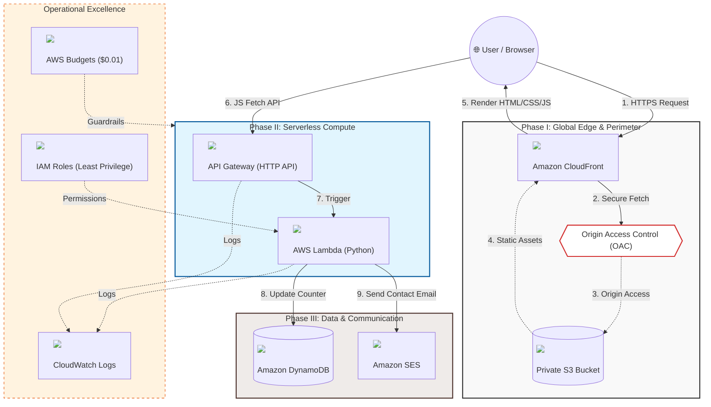

# Serverless Portfolio Architecture (AWS)

**Live Link:** [View my Live Resume](https://dzcey4h6erix0.cloudfront.net)

## Project Overview
This repository contains the infrastructure and code for a serverless portfolio website. The project transitions a traditional static site into a global, event-driven application with real-time visitor tracking and an integrated contact system.

## System Architecture

### Frontend & Global Delivery
* **Host:** Amazon S3 (Private Bucket).
* **CDN:** Amazon CloudFront.
* **Origin Security:** Implemented Origin Access Control (OAC). The S3 bucket policy is restricted to CloudFront service principals only, preventing direct S3 URL access and ensuring all traffic is encrypted via HTTPS.

### Backend Services (Python/Boto3)
* **API Layer:** Amazon API Gateway (HTTP API). Handles CORS headers to permit cross-domain requests from the CloudFront distribution.
* **Database:** Amazon DynamoDB. Stores visitor telemetry using an atomic counter to ensure data integrity during concurrent hits.
* **Compute:** * `visitor-counter-function.py`: Increments and retrieves site view counts.
    * `contact-form-functio.py`: Parses JSON payloads and triggers email delivery via Amazon SES.
* **Communication:** Amazon SES (Simple Email Service) configured with verified identity for secure form routing.

## Security & Operations
* **IAM Policy:** Followed the principle of least privilege for Lambda execution roles, scoping permissions to specific Resource ARNs (DynamoDB table and SES identity).
* **Cost Management:** Established AWS Budget alerts at a $0.01 threshold to monitor resource consumption in real-time.
* **Caching:** Configured manual CloudFront invalidations (/*) to manage content updates across edge locations.

## Technical Notes & Troubleshooting
* **CORS Management:** Managed Access-Control-Allow-Origin and Access-Control-Allow-Methods (OPTIONS, POST) within API Gateway to resolve browser-side blocking issues during the integration phase.
* **Event Parsing:** Configured Lambda handlers to properly decode event['body'] strings sent from the frontend fetch() API.
